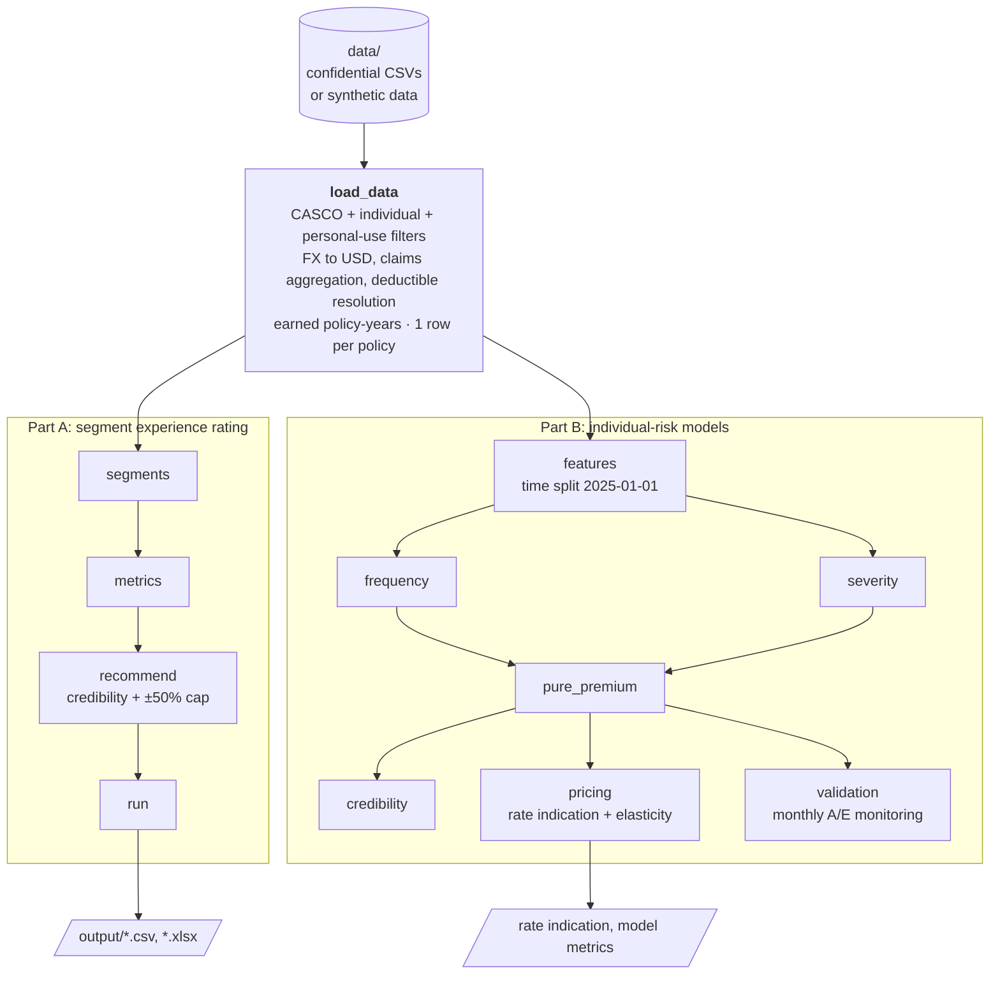
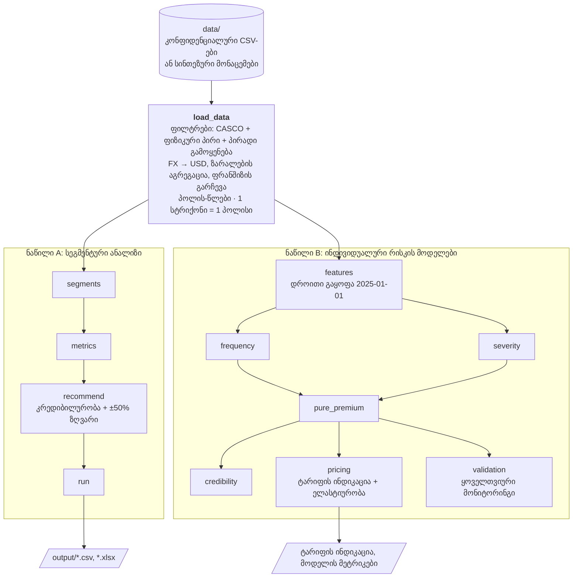

<!--
  CASCO Insurance Pricing Model
  Bilingual README (English / ქართული)
-->

<p align="center">
  <a href="#english">🇺🇸 English</a> &nbsp;•&nbsp;
  <a href="#georgian">🇬🇪 ქართული</a>
</p>

<hr>

<!-- ############################## ENGLISH ############################## -->
<a id="english"></a>

<h1 align="center">CASCO Insurance Pricing Model</h1>
<p align="center"><em>Claims-cost modelling · Experience rating · GLM / GBM · Credibility</em></p>

<p align="center">
  <a href="https://github.com/Choquri2000/CASCO-Pricing-Model/actions/workflows/tests.yml"></a>
  
  
  
  
</p>

---

### 📋 Overview

An end-to-end actuarial pricing project built for the **TBC Insurance technical task** — motor own-damage insurance (CASCO) for individual clients with personal-use vehicles.

**The business question:** the current tariff is generic (client age, vehicle type, deductible, sum insured). *Where does the price not match the real loss experience, and how should it be adjusted?*

**The answer, in two parts:**

| Part | What it is | Output |
|---|---|---|
| **A — Segment experience rating** | Loss ratio for every combination of the 4 rating factors; credibility-weighted, capped rate corrections vs. a target loss ratio | Rate corrections for 1,056 segments (CSV + Excel) |
| **B — Individual-risk models** | Frequency × severity GLMs, LightGBM challengers, Tweedie, Bühlmann-Straub credibility, model-based rate indication with elasticity, monthly monitoring | Out-of-time validated models + rate indication |

> 🔒 **Data is confidential.** The TBC Insurance files are not in this repository. A **synthetic data set** with the same schema can be generated in seconds, so the code and all 53 tests run without them (see [Run](#-run)).

> 🔍 **Methodology review (v2).** After submission I re-examined the method and corrected five issues: the Gini metric, the exposure base, the LogNormal retransformation, the client filter and Part A credibility. The [review](docs/review.md) documents each fix with before/after figures; the numbers below are the corrected (v2) results.

---

### 📊 Key Findings

| Portfolio metric | Value |
|---|---|
| Policies analysed (individual clients, personal use) | **115,116** |
| Earned premium | GEL 163.9M |
| Incurred claims | GEL 115.7M |
| **Loss ratio** | **70.6%** vs 60% target → the book needs **+17.7%** overall |

- **Young drivers (21–29)** run loss ratios of **87–89%** vs **63%** for drivers over 40 — even though they already pay the highest rates.
- **No-deductible policies** run at **74.4%** vs **54.9%** with a deductible, yet both pay the **same average rate** — the deductible is not priced.
- **Low sum-insured vehicles** are under-priced: loss ratios of ~70–87% below USD 12k vs **48%** above USD 50k.
- **Sedans** (77.7%) run materially hotter than **off-road / SUV-class vehicles** (67.4%).

**Recommended rate changes (Part A, one-way, credibility-weighted):**

| Factor | Loss ratio | Change | vs. book (+17.7%) |
|---|---|---|---|
| Age 21–25 / 26–29 | 86.7% / 88.9% | +44.5% / +48.1% | +23% / +26% |
| Age >40 | 63.0% | +5.1% | −11% |
| Sedan / Off-road-SUV | 77.7% / 67.4% | +29.5% / +12.4% | +10% / −5% |
| No deductible / With deductible | 74.4% / 54.9% | +24.0% / −8.5% | +5% / −22% |

Across the 1,056 composite segments, **238** need more than +5% on top of the book-wide increase and **90** need more than 5% less.

---

### 🏗️ Architecture



---

### 🧪 Methodology Highlights

| Decision | Why |
|---|---|
| **Time-based split** (train `< 2025-01-01`, test after) | A random split leaks future policies into training |
| **Exposure = earned policy-years**, not earned premium | Premium already contains the price being evaluated |
| **Offset re-applied at prediction** (GLM offset, LightGBM `init_score`) | Otherwise part-year policies get annual expected counts |
| **LogNormal severity + Duan smearing** | `exp(E[log S])` is the median; smearing (×1.78) restores the mean |
| **Exposure-weighted Gini on the predicted rate** + current-premium baseline | A raw Gini rewards policy size — even "years on risk" alone scored 0.25 |
| **Square-root credibility on claim counts**, complement = portfolio indication | Thin segments move with the book instead of defaulting to "no change" |
| **Bühlmann-Straub with policy count** as the volume | Premium-based volume makes every segment "fully credible" (Z ≈ 0.99) |

**Out-of-time results (test set, exposure-weighted Gini):**

| Model | Frequency | Pure premium |
|---|---|---|
| Poisson GLM / Freq × Sev GLM | 0.201 | 0.300 |
| LightGBM (Poisson) / Tweedie GBM | **0.235** | 0.290 |
| *Current premium (baseline)* | *0.109* | *0.303* |

The models rank **claim frequency** about twice as well as the current tariff. On total cost they only match it, because the tariff already orders cost through the sum insured. Their value is in finding **mispriced policies**: the predicted loss ratio ranks actual loss ratios on the hold-out with a Gini of **0.159**, above the segment/credibility approach (0.124).

---

### 🗂️ Repository Structure

```
CASCO-Pricing-Model/
├── src/
│   ├── load_data.py      # cleaning & joins — the only module that touches raw data
│   ├── segments.py       # 4 rating dimensions + composite segment key
│   ├── metrics.py        # loss ratio, rate, frequency, severity aggregates
│   ├── recommend.py      # credibility-weighted, capped rate corrections
│   ├── run.py            # Part A pipeline → CSV + Excel
│   ├── features.py       # modelling frame + time-based split
│   ├── frequency.py      # Poisson / NegBin GLM, LightGBM, Gini metrics
│   ├── severity.py       # LogNormal GLM (smearing), LightGBM Gamma
│   ├── pure_premium.py   # freq × sev, Tweedie GBM, calibration
│   ├── credibility.py    # Bühlmann-Straub
│   ├── pricing.py        # technical premium, rate indication, elasticity
│   ├── validation.py     # monthly actual-vs-expected monitoring
│   ├── eda.py            # 9-step exploratory analysis
│   └── experiments.py    # 9 what-if experiments defending each choice
├── tests/                # 53 tests across 11 modules
├── scripts/
│   └── make_synthetic_data.py   # synthetic data set with the same schema
├── docs/
│   ├── review.md / review.ka.md                 # methodology review: v2 corrections
│   ├── report.md / report.ka.md                 # original analysis report (v1)
│   ├── task_brief.md / task_brief.ka.md         # original task
│   ├── presentation/                            # slides: .md, .html, .pdf (v1)
│   └── modules/                                 # per-module documentation
├── .github/workflows/tests.yml   # CI: tests on synthetic data
├── data/README.md        # expected input files (data itself is not shared)
└── requirements.txt
```

---

### 🚀 Run

```bash
git clone https://github.com/Choquri2000/CASCO-Pricing-Model.git
cd CASCO-Pricing-Model
pip install -r requirements.txt

# Option A — synthetic data (anyone can run this)
python scripts/make_synthetic_data.py              # writes data/synthetic/
export CASCO_DATA_DIR=data/synthetic               # PowerShell: $env:CASCO_DATA_DIR="data/synthetic"

# Option B — the real files: place them in data/ (see data/README.md) and skip the two lines above

python -m src.run            # Part A: segment rate corrections  → output/
python -m src.pure_premium   # Part B: freq × sev vs Tweedie vs current premium
python -m src.pricing        # Part B: model-based rate indication
python -m src.validation     # Part B: monthly monitoring
python -m src.experiments    # 9 what-if experiments
python -m tests.run_all      # all 53 tests  (or: pytest tests/)
```

Results on synthetic data differ from the figures above — those come from the confidential data.

---

### ⚠️ Limitations & Next Steps

- The most recent months are immature (claims still being reported) and are not yet developed (IBNR / chain-ladder).
- Target loss ratios (60% in Part A, 65% in Part B) are management assumptions and should be aligned before use.
- Elasticity (−0.5) is assumed — it should be estimated from renewal / lapse data.

---

### 📚 Documentation

- 🔍 **Methodology review (v2):** [English](docs/review.md) · [ქართული](docs/review.ka.md)
- 📄 **Original report (v1):** [English](docs/report.md) · [ქართული](docs/report.ka.md)
- 🎯 **Task brief:** [English](docs/task_brief.md) · [ქართული](docs/task_brief.ka.md)
- 🖥️ **Presentation (v1):** [English PDF](docs/presentation/presentation.pdf) · [ქართული PDF](docs/presentation/presentation.ka.pdf)
- 🧩 **Module docs:** [load_data](docs/modules/load_data.md) · [segments](docs/modules/segments.md) · [metrics](docs/modules/metrics.md) · [recommend](docs/modules/recommend.md) · [run](docs/modules/run.md)

---

### 👤 Author

**Beka Chokuri** — [LinkedIn](https://www.linkedin.com/in/beka-chokuri/) · [GitHub](https://github.com/Choquri2000)

<p align="right">
  <a href="#georgian">🇬🇪 ქართული ↓</a>
</p>

<hr>

<!-- ############################## GEORGIAN ############################## -->
<a id="georgian"></a>

<h1 align="center">CASCO დაზღვევის ტარიფიკაციის მოდელი</h1>
<p align="center"><em>ზარალის ღირებულების მოდელირება · გამოცდილებაზე დაფუძნებული რეიტინგი · GLM / GBM · კრედიბილურობა</em></p>

---

### 📋 მიმოხილვა

სრული აქტუარული ტარიფიკაციის პროექტი, შესრულებული **TBC დაზღვევის ტექნიკური დავალებისთვის** — ავტომობილის დაზღვევა (CASCO) ფიზიკური პირებისთვის, პირადი გამოყენების ავტომობილებზე.

**ბიზნეს კითხვა:** ამჟამინდელი ტარიფი ზოგადია (კლიენტის ასაკი, ავტომობილის ტიპი, ფრანშიზა, დაზღვეული თანხა). *სად არ შეესაბამება ფასი რეალურ ზარალიანობას და როგორ უნდა დაკორექტირდეს?*

**პასუხი, ორ ნაწილად:**

| ნაწილი | რა არის | შედეგი |
|---|---|---|
| **A — სეგმენტური ანალიზი** | ზარალიანობა ტარიფის 4 ფაქტორის ყველა კომბინაციისთვის; კრედიბილურობით შეწონილი და შეზღუდული ტარიფის კორექცია სამიზნე ზარალიანობასთან შედარებით | 1,056 სეგმენტის ტარიფის კორექცია (CSV + Excel) |
| **B — ინდივიდუალური რისკის მოდელები** | სიხშირე × სიმძიმის GLM-ები, LightGBM, Tweedie, ბიულმან-შტრაუბის კრედიბილურობა, მოდელზე დაფუძნებული ტარიფის ინდიკაცია ელასტიურობით, ყოველთვიური მონიტორინგი | დროით გარეთ ვალიდირებული მოდელები + ტარიფის ინდიკაცია |

> 🔒 **მონაცემები კონფიდენციალურია.** TBC დაზღვევის ფაილები რეპოზიტორიაში არ არის. იმავე სტრუქტურის **სინთეზური მონაცემები** რამდენიმე წამში გენერირდება, ამიტომ კოდი და 53-ვე ტესტი მათ გარეშეც ეშვება (იხ. [გაშვება](#-გაშვება)).

> 🔍 **მეთოდოლოგიის გადახედვა (v2).** წარდგენის შემდეგ მეთოდი ხელახლა შევამოწმე და გავასწორე ხუთი პრობლემა: Gini მეტრიკა, ექსპოზიციის ბაზა, LogNormal-ის უკუგარდაქმნა, კლიენტების ფილტრი და ნაწილი A-ს კრედიბილურობა. [გადახედვაში](docs/review.ka.md) თითოეული შესწორება აღწერილია „მანამდე/შემდეგ“ მაჩვენებლებით; ქვემოთ მოცემულია შესწორებული (v2) შედეგები.

---

### 📊 მთავარი მიგნებები

| პორტფელის მეტრიკა | მნიშვნელობა |
|---|---|
| გაანალიზებული პოლისები (ფიზიკური პირები, პირადი გამოყენება) | **115,116** |
| გამომუშავებული პრემია | GEL 163.9M |
| ზარალი | GEL 115.7M |
| **ზარალიანობა** | **70.6%** 60%-იანი სამიზნის ნაცვლად → პორტფელს საერთო ჯამში **+17.7%** სჭირდება |

- **ახალგაზრდა მძღოლები (21–29)** — ზარალიანობა **87–89%**, 40+ ასაკის მძღოლებთან **63%**-ია — მიუხედავად იმისა, რომ ისინი უკვე ყველაზე მაღალ ტარიფს იხდიან.
- **ფრანშიზის გარეშე პოლისები** — **74.4%**, ფრანშიზიანებთან **54.9%**, თუმცა ორივე **ერთსა და იმავე საშუალო ტარიფს** იხდის — ფრანშიზა ფასში არ არის ასახული.
- **დაბალი დაზღვეული თანხის ავტომობილები** ნაკლებადაა შეფასებული: ზარალიანობა USD 12k-მდე ~70–87%-ია, USD 50k-ზე ზემოთ კი **48%**.
- **სედანები** (77.7%) მნიშვნელოვნად უარესია, ვიდრე **მაღალი გამავლობის ავტომობილები** (67.4%).

**რეკომენდებული ტარიფის ცვლილებები (ნაწილი A, ერთფაქტორიანი, კრედიბილურობით შეწონილი):**

| ფაქტორი | ზარალიანობა | ცვლილება | პორტფელთან (+17.7%) შედარებით |
|---|---|---|---|
| ასაკი 21–25 / 26–29 | 86.7% / 88.9% | +44.5% / +48.1% | +23% / +26% |
| ასაკი >40 | 63.0% | +5.1% | −11% |
| სედანი / მაღალი გამავლობის | 77.7% / 67.4% | +29.5% / +12.4% | +10% / −5% |
| ფრანშიზის გარეშე / ფრანშიზით | 74.4% / 54.9% | +24.0% / −8.5% | +5% / −22% |

1,056 კომპოზიტური სეგმენტიდან **238**-ს პორტფელის საერთო ზრდაზე +5%-ზე მეტი დამატებითი ზრდა სჭირდება, **90**-ს კი — 5%-ზე მეტით ნაკლები.

---

### 🏗️ არქიტექტურა



---

### 🧪 მეთოდოლოგია

| გადაწყვეტილება | რატომ |
|---|---|
| **დროითი გაყოფა** (train `< 2025-01-01`, test — შემდეგ) | შემთხვევითი გაყოფა მომავლის პოლისებს ტრენინგში შეიტანდა |
| **ექსპოზიცია = გამომუშავებული პოლის-წლები** და არა პრემია | პრემია უკვე შეიცავს იმ ფასს, რომელიც უნდა შეფასდეს |
| **offset პროგნოზის დროსაც** (GLM offset, LightGBM `init_score`) | წინააღმდეგ შემთხვევაში არასრული წლის პოლისები წლიურ მოსალოდნელ რაოდენობას მიიღებს |
| **LogNormal სიმძიმე + დუანის smearing** | `exp(E[log S])` მედიანაა; smearing (×1.78) საშუალოს აღადგენს |
| **ექსპოზიციით შეწონილი Gini პროგნოზირებულ განაკვეთზე** + მიმდინარე პრემიის საბაზისო ხაზი | ნედლი Gini პოლისის ზომას აჯილდოებს — მხოლოდ „დაზღვევის წლებიც“ კი 0.25-ს იღებდა |
| **კვადრატული ფესვის კრედიბილურობა ზარალების რაოდენობაზე**, დანამატი = პორტფელის ინდიკაცია | მცირე სეგმენტები პორტფელთან ერთად მოძრაობს და არ რჩება „ცვლილების გარეშე“ |
| **ბიულმან-შტრაუბი პოლისების რაოდენობით** | პრემიით ყველა სეგმენტი „სრულად კრედიბილური“ ხდება (Z ≈ 0.99) |

**შედეგები დროით გარეთ (ტესტის პერიოდი, ექსპოზიციით შეწონილი Gini):**

| მოდელი | სიხშირე | სუფთა პრემია |
|---|---|---|
| Poisson GLM / სიხშირე × სიმძიმე GLM | 0.201 | 0.300 |
| LightGBM (Poisson) / Tweedie GBM | **0.235** | 0.290 |
| *მიმდინარე პრემია (საბაზისო)* | *0.109* | *0.303* |

**ზარალის სიხშირეს** მოდელები დაახლოებით ორჯერ უკეთ ალაგებს, ვიდრე მიმდინარე ტარიფი. ჯამურ ღირებულებაზე ისინი მხოლოდ უტოლდება ტარიფს, რადგან ტარიფი ღირებულებას დაზღვეული თანხის მეშვეობით უკვე ალაგებს. მათი ღირებულება **არასწორად შეფასებული პოლისების პოვნაშია**: პროგნოზირებული ზარალიანობა hold-out პერიოდზე რეალურ ზარალიანობას Gini = **0.159**-ით ალაგებს, რაც სეგმენტურ/კრედიბილურობის მიდგომაზე (0.124) მაღალია.

---

### 🚀 გაშვება

```bash
git clone https://github.com/Choquri2000/CASCO-Pricing-Model.git
cd CASCO-Pricing-Model
pip install -r requirements.txt

# ვარიანტი A — სინთეზური მონაცემები (ნებისმიერს შეუძლია გაშვება)
python scripts/make_synthetic_data.py              # ქმნის data/synthetic/-ს
export CASCO_DATA_DIR=data/synthetic               # PowerShell: $env:CASCO_DATA_DIR="data/synthetic"

# ვარიანტი B — რეალური ფაილები: ჩადეთ data/-ში (იხ. data/README.md) და ზემოთა ორი ხაზი გამოტოვეთ

python -m src.run            # ნაწილი A: სეგმენტების ტარიფის კორექციები → output/
python -m src.pure_premium   # ნაწილი B: სიხშირე × სიმძიმე vs Tweedie vs მიმდინარე პრემია
python -m src.pricing        # ნაწილი B: ტარიფის ინდიკაცია
python -m src.validation     # ნაწილი B: ყოველთვიური მონიტორინგი
python -m src.experiments    # 9 what-if ექსპერიმენტი
python -m tests.run_all      # 53-ვე ტესტი  (ან: pytest tests/)
```

სინთეზურ მონაცემებზე შედეგები ზემოთ მოცემულისგან განსხვავდება — ისინი კონფიდენციალური მონაცემებიდანაა.

---

### ⚠️ შეზღუდვები და შემდეგი ნაბიჯები

- ბოლო თვეები ჯერ „მოუმწიფებელია“ (ზარალები ჯერ კიდევ ცხადდება) და არ არის განვითარებული (IBNR / chain-ladder).
- სამიზნე ზარალიანობა (60% ნაწილ A-ში, 65% ნაწილ B-ში) მენეჯმენტის დაშვებაა და გამოყენებამდე უნდა შეთანხმდეს.
- ელასტიურობა (−0.5) დაშვებაა — უნდა შეფასდეს განახლების / გაუქმების მონაცემებით.

---

### 📚 დოკუმენტაცია

- 🔍 **მეთოდოლოგიის გადახედვა (v2):** [ქართული](docs/review.ka.md) · [English](docs/review.md)
- 📄 **ორიგინალი რეპორტი (v1):** [ქართული](docs/report.ka.md) · [English](docs/report.md)
- 🎯 **დავალების ტექსტი:** [ქართული](docs/task_brief.ka.md) · [English](docs/task_brief.md)
- 🖥️ **პრეზენტაცია (v1):** [ქართული PDF](docs/presentation/presentation.ka.pdf) · [English PDF](docs/presentation/presentation.pdf)
- 🧩 **მოდულების დოკუმენტაცია:** [load_data](docs/modules/load_data.ka.md) · [segments](docs/modules/segments.ka.md) · [metrics](docs/modules/metrics.ka.md) · [recommend](docs/modules/recommend.ka.md) · [run](docs/modules/run.ka.md)

---

### 👤 ავტორი

**ბექა ჩოქური** — [LinkedIn](https://www.linkedin.com/in/beka-chokuri/) · [GitHub](https://github.com/Choquri2000)

<p align="right">
  <a href="#english">🇺🇸 English ↑</a>
</p>
