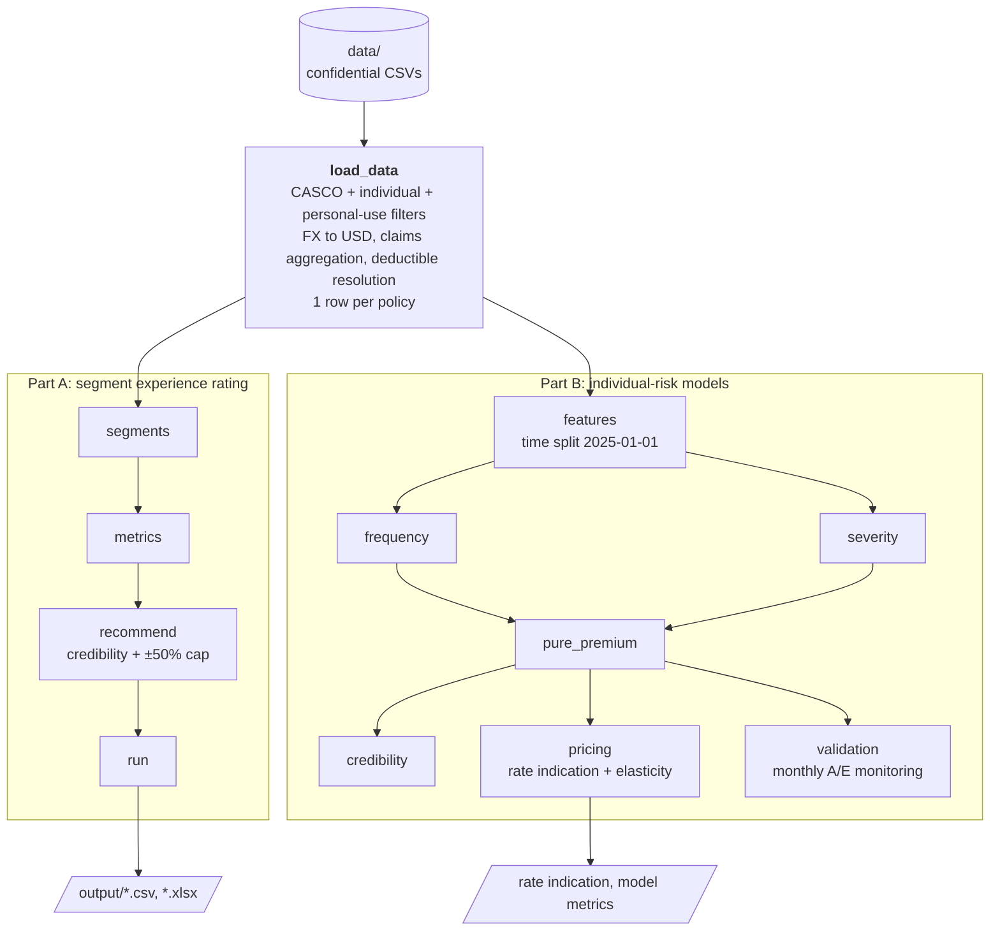
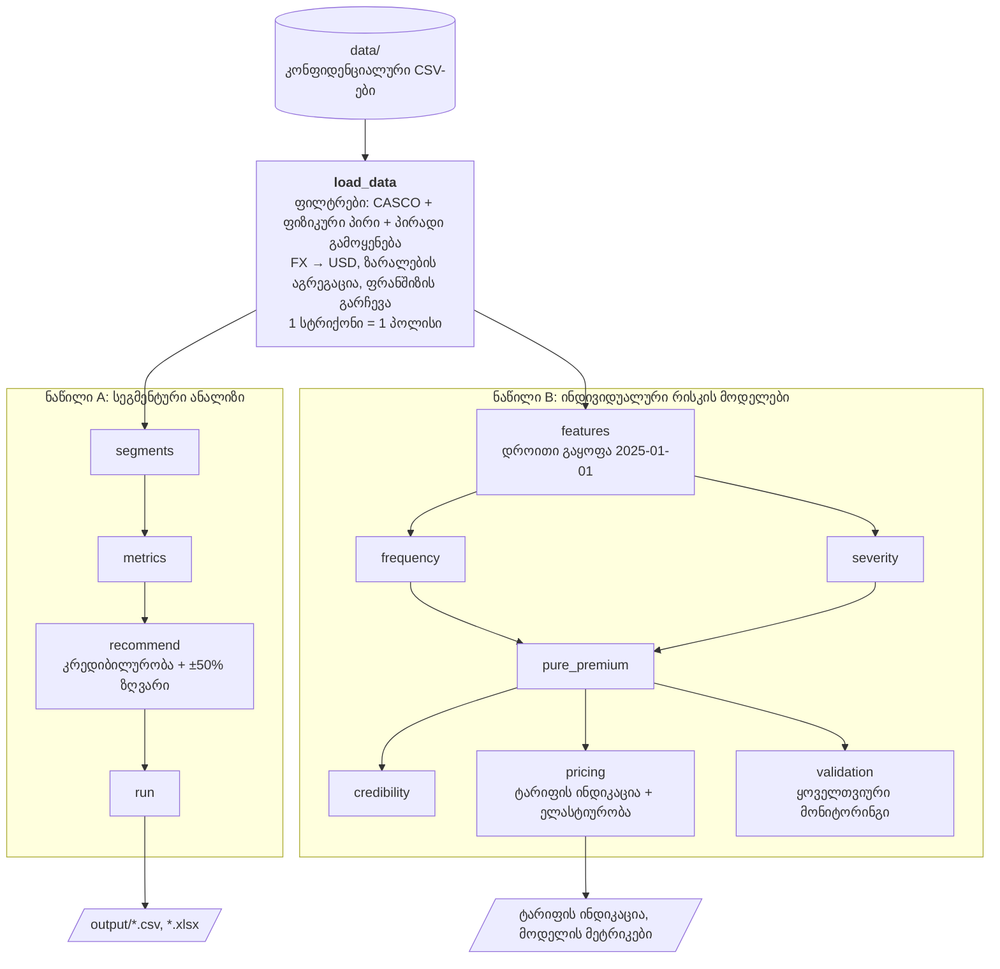

<!--
  CASCO Insurance Pricing Model
  Bilingual README (English / ქართული)
-->

<p align="center">
  <a href="#english">🇺🇸 English</a> &nbsp;•&nbsp;
  <a href="#georgian">🇬🇪 ქართული</a>
</p>

<hr>

<!-- ############################## ENGLISH ############################## -->
<a id="english"></a>

<h1 align="center">CASCO Insurance Pricing Model</h1>
<p align="center"><em>Claims-cost modelling · Experience rating · GLM / GBM · Bühlmann-Straub credibility</em></p>

<p align="center">
  
  
  
  
  
</p>

---

### 📋 Overview

An end-to-end actuarial pricing project built for the **TBC Insurance technical task** — motor own-damage insurance (CASCO) for individual clients with personal-use vehicles.

**The business question:** the current tariff is generic (client age, vehicle type, deductible, sum insured). *Where does the price not match the real loss experience, and how should it be adjusted?*

**The answer, in two parts:**

| Part | What it is | Output |
|---|---|---|
| **A — Segment experience rating** | Loss ratio for every combination of the 4 rating factors, credibility-weighted and capped price corrections vs. a target loss ratio | 1,264 segment rate corrections (CSV + Excel) |
| **B — Individual-risk models** | Frequency × severity GLMs, LightGBM challengers, Tweedie, Bühlmann-Straub credibility, model-based rate indication with elasticity, monthly monitoring | Out-of-time validated models + rate indication |

> 🔒 **Data is confidential.** The raw TBC Insurance files are not in this repository — only the code, tests and documentation. See [`data/README.md`](data/README.md) for the expected input files.

---

### 📊 Key Findings

| Portfolio metric | Value |
|---|---|
| Policies analysed | **119,745** |
| Earned premium | GEL 172.4M |
| Incurred claims | GEL 121.7M |
| **Loss ratio** | **70.6%** vs 60% target → book under-priced by **~18%** |

- **Young drivers (21–29)** run a loss ratio of **87–89%** vs **63%** for drivers over 40 — even though they already pay ~2× the rate.
- **No-deductible policies** run at **74.3%** vs **55.5%** with a deductible, yet both pay the **same average rate** — the deductible is not priced.
- **Low sum-insured vehicles** are the most under-priced: the loss ratio falls from ~75–85% in the smallest bands to **48%** above USD 50k — the rate does not differentiate enough by vehicle value.
- **Sedans** (78%) run materially hotter than **SUV-class vehicles** (67%).

---

### 🏗️ Architecture



---

### 🧪 Methodology Highlights

| Decision | Why |
|---|---|
| **Time-based split** (train `< 2025-01-01`, test after) | A random split leaks future policies and inflates the Gini |
| **GLM offset re-applied at prediction** | Without it the model predicts a rate, not an expected count (guarded by a test) |
| **LogNormal GLM instead of Gamma GLM** for severity | Gamma IRLS diverges on the heavy tail (demonstrated in `experiments.py`) |
| **Freq × Sev and direct Tweedie** | Interpretable decomposition plus a cross-check that handles the zero mass natively |
| **Credibility uses policy count**, not premium | Premium-based `n` makes every segment "fully credible" (Z ≈ 0.99 vs 0.36) |
| **±50% cap + credibility shrinkage** | Thin segments cannot produce extreme corrections |

**Out-of-time results (test set):**

| Model | Gini |
|---|---|
| Frequency — Poisson GLM | 0.391 |
| Frequency — LightGBM (Poisson) | 0.409 |
| Severity — LogNormal GLM | 0.266 |
| Pure premium — Freq × Sev (GLM) | **0.409** |
| Pure premium — Tweedie GBM | 0.356 |

Model-based indication: average rate change **+18.5%** against a 65% target LR, expected volume change −9.3% (elasticity −0.5).

---

### 🗂️ Repository Structure

```
CASCO-Pricing-Model/
├── src/
│   ├── load_data.py      # cleaning & joins — the only module that touches raw data
│   ├── segments.py       # 4 rating dimensions + composite segment key
│   ├── metrics.py        # loss ratio, rate, frequency, severity aggregates
│   ├── recommend.py      # credibility-weighted, capped rate corrections
│   ├── run.py            # Part A pipeline → CSV + Excel
│   ├── features.py       # modelling frame + time-based split
│   ├── frequency.py      # Poisson / NegBin GLM, LightGBM
│   ├── severity.py       # LogNormal GLM, LightGBM Gamma
│   ├── pure_premium.py   # freq × sev, Tweedie GBM, calibration
│   ├── credibility.py    # Bühlmann-Straub
│   ├── pricing.py        # technical premium, rate indication, elasticity
│   ├── validation.py     # monthly actual-vs-expected monitoring
│   ├── eda.py            # 9-step exploratory analysis
│   └── experiments.py    # 8 what-if experiments defending each choice
├── tests/                # 48 tests across 11 modules
├── docs/
│   ├── report.md / report.ka.md                 # full analysis report (EN / KA)
│   ├── task_brief.md / task_brief.ka.md         # original task (EN / KA)
│   ├── presentation/                            # slides: .md, .html, .pdf (EN / KA)
│   └── modules/                                 # per-module documentation (EN / KA)
├── data/README.md        # expected input files (data itself is not shared)
└── requirements.txt
```

---

### 🚀 Run

```bash
git clone https://github.com/Choquri2000/CASCO-Pricing-Model.git
cd CASCO-Pricing-Model
pip install -r requirements.txt
# place the confidential CSV files in data/  (see data/README.md)

python -m src.run            # Part A: segment rate corrections  → output/
python -m src.pure_premium   # Part B: freq × sev vs Tweedie
python -m src.pricing        # Part B: model-based rate indication
python -m src.validation     # Part B: monthly monitoring
python -m tests.run_all      # all 48 tests  (or: pytest tests/)
```

---

### ⚠️ Limitations & Next Steps

- Target loss ratios (60% in Part A, 65% in Part B) are management assumptions and should be aligned before use.
- Elasticity (−0.5) is assumed — it should be calibrated from renewal / lapse data.
- The most recent months are immature (claims still being reported), so their loss ratios are understated.
- Next: back-test the indication against realised loss ratios, and search the Tweedie variance power properly.

---

### 📚 Documentation

- 📄 **Full report:** [English](docs/report.md) · [ქართული](docs/report.ka.md)
- 🎯 **Task brief:** [English](docs/task_brief.md) · [ქართული](docs/task_brief.ka.md)
- 🖥️ **Presentation:** [English PDF](docs/presentation/presentation.pdf) · [ქართული PDF](docs/presentation/presentation.ka.pdf)
- 🧩 **Module docs:** [load_data](docs/modules/load_data.md) · [segments](docs/modules/segments.md) · [metrics](docs/modules/metrics.md) · [recommend](docs/modules/recommend.md) · [run](docs/modules/run.md)

---

### 👤 Author

**Beka Chokuri** — [LinkedIn](https://www.linkedin.com/in/beka-chokuri/) · [GitHub](https://github.com/Choquri2000)

<p align="right">
  <a href="#georgian">🇬🇪 ქართული ↓</a>
</p>

<hr>

<!-- ############################## GEORGIAN ############################## -->
<a id="georgian"></a>

<h1 align="center">CASCO დაზღვევის ტარიფიკაციის მოდელი</h1>
<p align="center"><em>ზარალის ღირებულების მოდელირება · გამოცდილებაზე დაფუძნებული რეიტინგი · GLM / GBM · ბიულმან-შტრაუბის კრედიბილურობა</em></p>

---

### 📋 მიმოხილვა

სრული აქტუარული ტარიფიკაციის პროექტი, შესრულებული **TBC დაზღვევის ტექნიკური დავალებისთვის** — ავტომობილის დაზღვევა (CASCO) ფიზიკური პირებისთვის, პირადი გამოყენების ავტომობილებზე.

**ბიზნეს კითხვა:** ამჟამინდელი ტარიფი ზოგადია (კლიენტის ასაკი, ავტომობილის ტიპი, ფრანშიზა, დაზღვეული თანხა). *სად არ შეესაბამება ფასი რეალურ ზარალიანობას და როგორ უნდა დაკორექტირდეს?*

**პასუხი, ორ ნაწილად:**

| ნაწილი | რა არის | შედეგი |
|---|---|---|
| **A — სეგმენტური ანალიზი** | ზარალიანობა ტარიფის 4 ფაქტორის ყველა კომბინაციისთვის; კრედიბილურობით შეწონილი და შეზღუდული ფასის კორექცია სამიზნე ზარალიანობასთან შედარებით | 1,264 სეგმენტის ტარიფის კორექცია (CSV + Excel) |
| **B — ინდივიდუალური რისკის მოდელები** | სიხშირე × სიმძიმის GLM-ები, LightGBM, Tweedie, ბიულმან-შტრაუბის კრედიბილურობა, მოდელზე დაფუძნებული ტარიფის ინდიკაცია ელასტიურობით, ყოველთვიური მონიტორინგი | დროით გარეთ ვალიდირებული მოდელები + ტარიფის ინდიკაცია |

> 🔒 **მონაცემები კონფიდენციალურია.** TBC დაზღვევის ნედლი ფაილები რეპოზიტორიაში არ არის — მხოლოდ კოდი, ტესტები და დოკუმენტაცია. საჭირო ფაილების ჩამონათვალი: [`data/README.md`](data/README.md).

---

### 📊 მთავარი მიგნებები

| პორტფელის მეტრიკა | მნიშვნელობა |
|---|---|
| გაანალიზებული პოლისები | **119,745** |
| გამომუშავებული პრემია | GEL 172.4M |
| ზარალი | GEL 121.7M |
| **ზარალიანობა** | **70.6%** 60%-იანი სამიზნის ნაცვლად → პორტფელი **~18%-ით** ნაკლებადაა შეფასებული |

- **ახალგაზრდა მძღოლები (21–29)** — ზარალიანობა **87–89%**, 40+ ასაკის მძღოლებთან **63%**-ია — მიუხედავად იმისა, რომ ისინი უკვე ~2-ჯერ მაღალ ტარიფს იხდიან.
- **ფრანშიზის გარეშე პოლისები** — **74.3%**, ფრანშიზიანებთან **55.5%**, თუმცა ორივე **ერთსა და იმავე საშუალო ტარიფს** იხდის — ფრანშიზა ფასში არ არის ასახული.
- **დაბალი დაზღვეული თანხის ავტომობილები** ყველაზე ნაკლებადაა შეფასებული: ზარალიანობა ყველაზე დაბალ დიაპაზონებში ~75–85%-ია, USD 50k-ზე ზემოთ კი **48%** — ტარიფი ავტომობილის ღირებულების მიხედვით საკმარისად არ დიფერენცირდება.
- **სედანები** (78%) მნიშვნელოვნად უარესია, ვიდრე **მაღალი გამავლობის ავტომობილები** (67%).

---

### 🏗️ არქიტექტურა



---

### 🧪 მეთოდოლოგია

| გადაწყვეტილება | რატომ |
|---|---|
| **დროითი გაყოფა** (train `< 2025-01-01`, test — შემდეგ) | შემთხვევითი გაყოფა მომავლის პოლისებს ტრენინგში შეიტანდა და Gini-ს ხელოვნურად გაზრდიდა |
| **GLM offset პროგნოზის დროსაც გამოიყენება** | მის გარეშე მოდელი მოსალოდნელ რაოდენობას კი არა, განაკვეთს პროგნოზირებს (ტესტით დაცულია) |
| **სიმძიმისთვის LogNormal GLM** Gamma GLM-ის ნაცვლად | Gamma IRLS მძიმე კუდზე იშლება (ნაჩვენებია `experiments.py`-ში) |
| **სიხშირე × სიმძიმე და პირდაპირი Tweedie** | ინტერპრეტირებადი დეკომპოზიცია + ნულოვანი მასის ბუნებრივად მომდელირებელი შემოწმება |
| **კრედიბილურობა პოლისების რაოდენობით** და არა პრემიით | პრემიით ყველა სეგმენტი „სრულად კრედიბილური“ ხდება (Z ≈ 0.99 vs 0.36) |
| **±50% ზღვარი + კრედიბილურობა** | მცირე სეგმენტები ექსტრემალურ კორექციას ვერ გამოიწვევს |

**შედეგები დროით გარეთ (ტესტის პერიოდი):**

| მოდელი | Gini |
|---|---|
| სიხშირე — Poisson GLM | 0.391 |
| სიხშირე — LightGBM (Poisson) | 0.409 |
| სიმძიმე — LogNormal GLM | 0.266 |
| სუფთა პრემია — სიხშირე × სიმძიმე (GLM) | **0.409** |
| სუფთა პრემია — Tweedie GBM | 0.356 |

მოდელზე დაფუძნებული ინდიკაცია: საშუალო ტარიფის ცვლილება **+18.5%** (სამიზნე ზარალიანობა 65%), მოსალოდნელი მოცულობის ცვლილება −9.3% (ელასტიურობა −0.5).

---

### 🚀 გაშვება

```bash
git clone https://github.com/Choquri2000/CASCO-Pricing-Model.git
cd CASCO-Pricing-Model
pip install -r requirements.txt
# კონფიდენციალური CSV ფაილები ჩადეთ data/ საქაღალდეში (იხ. data/README.md)

python -m src.run            # ნაწილი A: სეგმენტების ტარიფის კორექციები → output/
python -m src.pure_premium   # ნაწილი B: სიხშირე × სიმძიმე vs Tweedie
python -m src.pricing        # ნაწილი B: ტარიფის ინდიკაცია
python -m src.validation     # ნაწილი B: ყოველთვიური მონიტორინგი
python -m tests.run_all      # 48-ვე ტესტი  (ან: pytest tests/)
```

---

### ⚠️ შეზღუდვები და შემდეგი ნაბიჯები

- სამიზნე ზარალიანობა (60% ნაწილ A-ში, 65% ნაწილ B-ში) მენეჯმენტის დაშვებაა და გამოყენებამდე უნდა შეთანხმდეს.
- ელასტიურობა (−0.5) დაშვებაა — უნდა დაკალიბრდეს განახლების / გაუქმების მონაცემებით.
- ბოლო თვეები ჯერ „მოუმწიფებელია“ (ზარალები ჯერ კიდევ ცხადდება), ამიტომ მათი ზარალიანობა შემცირებულად ჩანს.
- შემდეგი ნაბიჯი: ინდიკაციის შემოწმება რეალიზებულ ზარალიანობაზე და Tweedie-ს ხარისხის სრულფასოვანი შერჩევა.

---

### 📚 დოკუმენტაცია

- 📄 **სრული რეპორტი:** [ქართული](docs/report.ka.md) · [English](docs/report.md)
- 🎯 **დავალების ტექსტი:** [ქართული](docs/task_brief.ka.md) · [English](docs/task_brief.md)
- 🖥️ **პრეზენტაცია:** [ქართული PDF](docs/presentation/presentation.ka.pdf) · [English PDF](docs/presentation/presentation.pdf)
- 🧩 **მოდულების დოკუმენტაცია:** [load_data](docs/modules/load_data.ka.md) · [segments](docs/modules/segments.ka.md) · [metrics](docs/modules/metrics.ka.md) · [recommend](docs/modules/recommend.ka.md) · [run](docs/modules/run.ka.md)

---

### 👤 ავტორი

**ბექა ჩოქური** — [LinkedIn](https://www.linkedin.com/in/beka-chokuri/) · [GitHub](https://github.com/Choquri2000)

<p align="right">
  <a href="#english">🇺🇸 English ↑</a>
</p>
